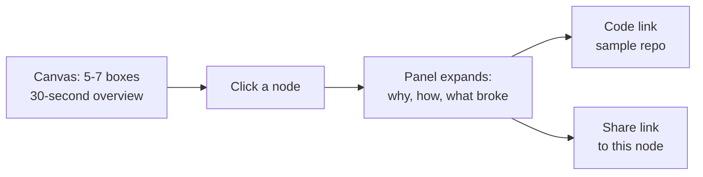
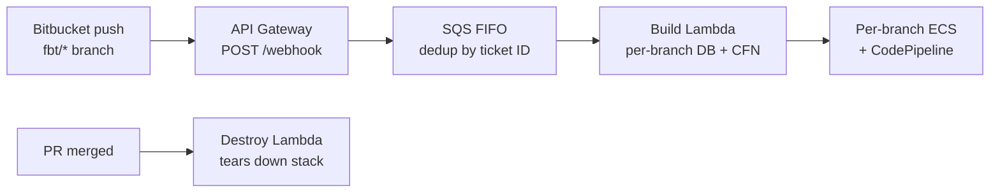

# Portfolio Site — Expectations & Plan

Sep 23, 2026 · Chiedozie Onyekwum

## Vision

Build a personal site where the infrastructure is the proof: interviewers don't read claims, they click into how things were built.

The site does two jobs. It shows who Chiedozie is as a person (chess, basketball, what fascinates him, the long-term dream of building a robust organization that solves real problems). And it lets an interviewer explore technical depth at their own pace, story by story, node by node.

The site itself should also be a working DevOps artifact: deployed through a real pipeline, with its build and health visible.

## Goals and success criteria

Success means an interviewer leaves curious and walks into the interview with specific questions.

- An interviewer can skim any flagship story in about 30 seconds, or drill into one node for real depth.
- Every flagship links to real code (sample repo or sanitized excerpts), not just descriptions.
- Any single node can be shared by URL, so a recruiter can send one engineering story to a hiring manager.
- The personal side (hobbies, interests, vision, current and future work) feels like a real person, not a template.
- The site stays cheap to maintain: content changes don't require touching the interactive framework.

## Site structure

Six sections, with the flagship deep dives as the centerpiece.

| Section | What it holds |
| --- | --- |
| Home | One-line identity, short intro, links into flagships |
| About | Background, chess, basketball, what fascinates you, the dream of building an organization |
| Flagship stories | Five interactive architecture canvases (see below) |
| Experience | Full timeline with richer bullets than the resume |
| Projects | DozLab, ECO-T, Sherloc, ML infrastructure, with GitHub links |
| Now / Next | Current work, upcoming projects, agentic solutions, distributed systems interests |

## Interaction model

Each flagship is one architecture canvas that unfolds as the interviewer clicks, so they control the depth.

Each node's panel answers three questions: why this design, how it worked, and what went wrong or was hard. Chosen over a GIF because clicking means the interviewer picked the topic, so they're already invested.

- Content lives in plain data files (one per story), separate from the canvas code.
- Every node gets its own URL anchor for sharing.
- Sample repos are linked per node, not as one big dump.

## The five flagship stories

Five stories get the full interactive canvas; each shows a different kind of depth.

| # | Story | Where | Depth it proves | Nodes to write |
| --- | --- | --- | --- | --- |
| 1 | Feature Branch Testing (FBT) + environment replication | Conclase | Platform engineering, Terraform at scale | Branch trigger, env provisioning, state isolation, secrets/config, promotion local to prod, teardown and cost control |
| 2 | Air-gapped ban/alerting portal | Samsung | Shipping into a network with no internet | App stack (React, FastAPI, Postgres), SAML/SSO, custom PowerShell CI/CD, dependency handling offline, audit logging, AI opt-out detection |
| 3 | Strangler migration with Kafka | New (not on resume yet) | Distributed systems, event-driven design | Original monolith + workers + Redis, what was cut first, Kafka topology, dual writes, event ordering, state drift |
| 4 | DozLab | Side project | Building a platform on Kubernetes | Multi-tenancy, sidecar containers, VM-backed labs, WebSocket proxying, isolation |
| 5 | Research: machine unlearning + autonomous vehicle | Texas A&M | Rare differentiator for a DevOps profile | Unlearning problem and approach, sensor fusion on Jetson, YOLOv8 and LaneNet deployment |

For each node, write: the problem, the decision and why, and one thing that broke or surprised you.

### Flagship 1 detail: FBT node map

The real story is hybrid: Terraform owns the persistent layer, and Lambda-rendered CloudFormation owns disposable per-branch stacks.

| Node | Why (decision) | Depth to write |
| --- | --- | --- |
| Webhook filter | Only `fbt/<ticket>` branches spin up stacks | Branch naming convention, ticket ID regex |
| API Gateway | Custom integration, narrowly scoped Lambda permission | Why not proxy integration; throttling and access logs |
| SQS FIFO | Repeat pushes must not create duplicate clusters | Dedup and grouping by ticket ID, idempotency check |
| Build Lambda + CloudFormation | Keep short-lived resources out of shared Terraform state | Lock contention, drift, plan noise; why CFN fits disposable stacks |
| Per-branch ECS stack | Full isolation per feature | Service, pipeline, routing per branch |
| Merge-triggered teardown | Nobody deletes branch infra by hand | Destroy flow, failure handling, cost control |
| Shared layer (side node) | Persistent infra that must always exist | Separate region/VPC inside staging account, Aurora, per-env KMS keys, secrets namespaced per env |
| Terraform backend bootstrap (side node) | Terraform can't create its own state store | One-time CFN stack for state bucket, KMS key, lock table |
| DB reset from staging (side node) | Realistic data without touching production | Restore, truncate sensitive tables, vacuum and reindex |

**"What was hard" candidates:** SQS dedup for idempotent builds, and isolating FBT in its own region so branch churn stays off staging.

**Resume fix:** the FBT bullet should name the Terraform + Lambda-driven CloudFormation split, not just "Terraform and AWS."

### Sanitization checklist (before publishing FBT)

- [ ] Remove the AWS account ID.
- [ ] Replace internal hostnames, domains, bucket names and cluster endpoints with generic placeholders.
- [ ] Remove the client name; describe it as a healthcare client.
- [ ] Describe the unauthenticated webhook only generically, as a hardening lesson (IP allowlisting via resource policy), and only if it has been fixed.
- [ ] Sample repo uses fake names, fake CIDRs and a toy app, never client code.
- [ ] Check what your contract allows you to share publicly.

## Supporting stories

These stay as richer bullets on the Experience page, one or two sentences deeper than the resume, no canvas.

- **Azure VM image pipeline:** on-prem artifact ingestion, first-logon PowerShell provisioning, versioned images in Shared Image Gallery, handoff to test. Signals rare Windows depth.
- **Security hardening:** CIS Benchmarks, automated cert regeneration, Firewall Manager consolidation, rootless Docker runners, secure SFTP for regulated B2B exchange.
- **On-call and incidents:** 24/7 rotation, P1/P2 via ServiceNow and PagerDuty.
- **Gwrite:** Vault for Kubernetes secrets, SAP migration to Azure (70% RTO reduction), Tekton pipelines, AKS setup.
- **PKI and blockchain research:** decentralizing Certificate Authorities.
- **Firecracker:** worth a line once the story is clear (possibly part of DozLab).

## Resume gaps to fix

The site and resume should tell the same story, so fix these alongside the build.

- [ ] Add the Kafka strangler migration as its own bullet (which role and dates?).
- [ ] Add Kafka and Redis to the skills list.
- [ ] Rewrite the "contributed to monolith-to-microservices" bullet to name the strangler approach.
- [ ] Clarify the Firecracker context, or drop it if there's no story behind it.
- [ ] The summary mentions RAG-style AI work; tie it to a concrete bullet (e.g. the Samsung opt-out detection).

## Tech and hosting

Start free and static: GitHub Pages on the GitHub Student Pack domain, deployed by GitHub Actions.

| Piece | Choice | Why |
| --- | --- | --- |
| Domain | Free domain from GitHub Student Pack | Already available |
| Hosting | GitHub Pages | Free, custom domain support, no servers |
| Build | Static site generator (e.g. Astro or plain HTML/JS) | Content in data files, fast pages |
| Canvases | SVG or a light diagram library, clickable nodes | No backend needed |
| CI/CD | GitHub Actions: lint, build, link check, deploy | The pipeline is itself part of the demo |
| Visible ops | Public build status and a simple uptime badge | Shows the site is run like production |

Optional later: move live demos (e.g. DozLab) to a free-tier cloud or Student Pack credits, and link them from the flagship.

## Phased plan and open questions

Ship a simple live site first, then add flagships one at a time.

1. **Phase 1 — Foundation:** domain, GitHub Pages, Actions pipeline, Home, About, Experience, Projects, Now/Next.
2. **Phase 2 — First flagship:** build the canvas framework using FBT; write all its node content and link sample code.
3. **Phase 3 — Remaining flagships:** air-gapped, Kafka strangler, DozLab, research, one per iteration.
4. **Phase 4 — Polish:** shareable node links, build status on the site, resume updates aligned.

Open questions:

- Which local code can be shared publicly, and what must be sanitized (client and Samsung work)?
- Which role and dates does the Kafka strangler migration belong to?
- What is the Firecracker story?
- Should any flagship have a live, runnable demo, or are canvases plus code enough?

## Context from our conversations

Everything Chiedozie said about what he wants, captured so the build doesn't lose it.

### What the site should do

- Make the resume come to life: not just talk about what he did, but let people click into each experience.
- Show him as a person: chess, basketball, hobbies, what interests and fascinates him.
- Show the dream: build a very robust organization that helps solve a lot of problems, in any way it can.
- Show current work, the project he is working on now, the ones he is yet to start, agentic solutions, distributed services, and his skill sets in general.
- Include a live demo that shows DevOps skills, pulling from GitHub or anywhere else useful.
- Each experience tells a different story and a different problem. An interviewer should be able to traverse the connections in that story.
- Share technical details chunk after chunk, the way a video moves step by step, but interactive and not a GIF. The goal is to make the interviewer curious.
- Where possible, add a sample repo per story (some code base is on his local machine) and link it from the site.
- He wants more than four flagship stories; the plan settled on five.

### Stories as he described them

- **Azure image pipeline:** takes artifacts from on-premise into the cloud, puts them into an image using Azure Shared Image Gallery, then sends it to the test team to implement features. It shows his understanding of Windows, PowerShell and first-logon provisioning. Keep it as a "I still got it" signal, not a flagship, so it doesn't dilute the strongest stories.
- **Strangler migration (new, not on resume):** there was one huge monolith with many workers, using Redis and Kafka but not in a technical way. He migrated responsibility off the monolith into new microservices, strangler style: not a total migration, but moving responsibilities out piece by piece. He set up Kafka and the microservices himself. Kafka is missing from the resume skills list.
- **Kubernetes:** his worry is that "everybody runs Kubernetes." The answer: frame it as building a platform on Kubernetes (DozLab), not just running it.
- **FBT:** see the FBT technical notes section below.

### Decisions made in chat

- Interactive canvases chosen over a GIF: the interviewer controls pace and depth.
- Five flagships (FBT, air-gapped Samsung, Kafka strangler, DozLab, research); everything else is a richer bullet.
- Build the site with Claude Code in the CLI; do planning and node writing in chat and the plan doc.
- This file lives in the repo root as `PLAN.md` for Claude Code.

## FBT technical notes (sanitized)

Full technical detail from Chiedozie's FBT write-up, with client identifiers removed (account ID, client name, domains, buckets, hostnames, ticket prefixes).

### Setup

- Ephemeral per-feature-branch environment: every branch named `fbt/<ticket>-...` gets its own throwaway Django/ECS stack.
- Backed by a shared FBT database cluster and shared base networking, KMS and secrets.
- Not a separate AWS account: a separate region and VPC inside the staging account. FBT in `us-east-2`; staging and production in `us-east-1`. Keeps branch churn off staging's region and VPC.
- VPC CIDR `/16` of its own. Terraform root per account and region; modules for the persistent FBT layer plus two Lambda modules (build cluster, destroy cluster).

### Two layers

- **Terraform (persistent, shared):** VPC, shared Aurora Postgres cluster, ECR repos, KMS keys, Route 53 zones, ACM certs, S3 buckets (static, user files, SFTP, CloudFront logs), SNS topics, Teams webhook notifications, base Docker image build pipeline.
- **CloudFormation, used in exactly two places on purpose:**
    - Bootstrapping the Terraform backend: Terraform can't manage the bucket and lock table that hold its own state. A one-time CFN stack creates the versioned, KMS-encrypted, deletion-protected state bucket, the KMS key and the DynamoDB lock table; outputs go into each `backend.tf`.
    - Per-branch ECS stacks: a Lambda renders and applies `ecs.yaml` and `codepipeline.yaml` per branch. `terraform apply` per branch would be slow and put dozens of short-lived resources into shared state (lock contention, drift, plan noise). Each CFN stack is independent, disposable and never touched by a human.

### Build and destroy flow

1. Bitbucket push webhook on a new `fbt/` branch hits API Gateway, which invokes the build Lambda's API handler.
2. The handler confirms it's a new `fbt/` branch, extracts the Jira ticket ID with a regex, and drops a message on an SQS FIFO queue grouped and deduplicated by ticket ID.
3. The build worker (shared FBT library) checks whether a cluster already exists for the ticket, builds a per-branch database, and applies the ECS and CodePipeline CFN templates.
4. Result: a per-branch ECS service and CodePipeline running against the shared FBT database.
5. On PR merged (state `MERGED`, `fbt/` branch), a second API triggers the destroy Lambda via its own SQS queue, which tears down the CFN stack. Nobody deletes branch infra by hand.

### API Gateway details

- Two separate REGIONAL REST APIs (build, destroy), each with one resource: `POST /webhook`, registered as the Bitbucket webhook target.
- Integration type `AWS` (custom), not `AWS_PROXY`, forwarding to the Lambda invoke ARN, with a 200 JSON method and integration response.
- The response model schema looks copy-pasted from an SFTP (Transfer Family) module and doesn't match what the Lambdas return. Boilerplate, not real validation.
- Authorization is `NONE`. A TODO exists to restrict it to Bitbucket Cloud IP ranges with a resource policy. Today the Lambda code does the filtering, not the gateway. **Private: only discuss publicly as a generic hardening lesson, once fixed.**
- Lambda permission is narrowly scoped: only this API's execution ARN can invoke it.
- Stage named `fbt`, access logs to a dedicated CloudWatch log group (source IP, caller, time, method, path, status, length, request IDs).
- CloudWatch metrics and INFO execution logging on; throttling 1000 req/s steady, 500 burst; cache encryption on (no caching configured).

### Secrets

- Same Terraform secrets module as staging and production, parameterized by environment.
- Path convention `/fbt/<name>_settings` (app, SFTP, backup, devops), mirroring `/staging/...` and `/production/...`.
- Each environment has its own Secrets Manager KMS key, limiting blast radius.
- Configurable recovery window per secret.
- Cross-region replication exists in the module but is disabled because of a known Terraform AWS provider bug (#23316).
- Drift checked manually with diff scripts (FBT vs staging, staging vs prod) against an ignore allowlist; temp files deleted afterward. The staging-vs-prod check is a release step.

### Database reset

FBT data is periodically reset from a staging backup, not independently seeded:

1. Pull the latest encrypted staging backup from S3 and decrypt it (key from Secrets Manager).
2. Terminate connections to the shared FBT Aurora cluster, drop and recreate the database.
3. Recreate extensions (postgis, hstore, pg_stat_statements, etc.).
4. Restore from the staging dump.
5. Truncate sensitive or noisy tables (API request logs, user IdP data).
6. Run `vacuumdb` and `reindexdb`.

A one-shot bash script against the shared cluster, not per branch.

### Key decisions

| Decision | Why |
| --- | --- |
| FBT in the staging account, separate region | Reuses staging's IAM and billing boundary while keeping branch churn out of staging's VPC |
| Terraform for persistent infra, CFN for backend bootstrap and per-branch stacks | Avoids the state-backend cycle and keeps short-lived resources out of shared state |
| Lambda-driven build and destroy off Bitbucket webhooks | Branches are created and merged far more often than releases; automation matches the cadence |
| Secrets namespaced per environment, each with its own KMS key | One module reused everywhere; contained blast radius |
| DB is a periodic restore of staging | Realistic data without touching production |
| Secret drift checked by diff scripts, not continuous sync | Secrets differ by design; review catches unintended drift |

## Student Pack and demo decisions

Launch needs only a domain, GitHub Pages and GitHub Actions; the rest is optional.

| Offer | Use | Status |
| --- | --- | --- |
| Name.com (`.dev`, e.g. `chiedozie.dev`) | Domain | Preferred; free first year, renewals paid |
| Namecheap `.me` or `.TECH` | Domain | Backups if `.dev` name is taken |
| GitHub Pages | Hosting | Free HTTPS, custom domain; skip the Namecheap SSL cert |
| GitHub Actions + GitHub Pro | CI/CD | Included |
| LocalStack | AWS emulator for the FBT demo | Free for verified students (non-commercial); now needs an account and auth token |
| Floci | No-auth AWS emulator | Alternative for the public repo; claims ECS support; test before relying on it |
| Sentry or SimpleAnalytics | Errors or privacy-friendly analytics | Optional, shows the site is run like production |
| Azure $100 credit, Heroku, Appwrite | Live demos like DozLab | Only if a runnable demo is wanted |
| Doppler | Secrets handling in sample repos | Optional |

### Three levels of demo for interviewers

Most interviewers won't run anything, so each level proves the same thing with less effort:

1. **Watch:** each node panel shows a short real terminal recording (e.g. asciinema) of that step.
2. **Check the proof:** the sample repo's GitHub Actions workflow runs the full FBT flow on the emulator on every push and asserts each step. A passing badge links to real run logs.
3. **Run it:** an "Open in Codespaces" button, then one command (`make demo`) runs it in the browser.

For the FBT demo, simulate the ECS part with a tiny stand-in container rather than rebuilding the full stack.

## Source material: resume

Facts from the current resume, for the Experience, Projects and About pages.

**Contact:** chiedozieonyekwum@outlook.com, LinkedIn, GitHub (decide whether to show the phone number publicly).

**Summary:** DevOps/MLOps engineer across cloud infrastructure, cybersecurity and AI; secure, scalable systems on AWS and Azure; M.Sc. research in federated learning, machine unlearning and autonomous systems; focus on privacy, observability and responsible deployment.

**Education:** Texas A&M University, M.Sc. Computer Science, GPA 3.85, expected Dec 2026. University of Port Harcourt, B.Eng. Mechanical Engineering.

**Skills:** Go, Python, Bash, PowerShell, JavaScript, TypeScript · Docker, Kubernetes, Firecracker · Terraform, Pulumi, Terragrunt, Spacelift, Azure DevOps, GitHub Actions, CircleCI, Helm · Prometheus, ELK, Datadog, Fluent Bit, Jira, ServiceNow, PagerDuty · Kubeflow, MLflow, Azure Databricks, LangChain, YOLOv8, LaneNet, Nginx. (Add: Kafka, Redis.)

| Role | Org, location | Dates | Highlights |
| --- | --- | --- | --- |
| AI/ML Engineer Co-op | Samsung Austin Semiconductor, Austin, TX | Jan 2026 – Aug 2026 | AI opt-out detection from free-form replies to incident alerts, with suppression and rate limiting; full-stack ban/alerting portal (React, TypeScript, FastAPI, PostgreSQL, SAML/SSO); custom PowerShell CI/CD into an air-gapped environment with audit logging |
| Graduate Research Assistant | Texas A&M University | Apr 2025 – Dec 2025 | Machine unlearning (security, privacy); PKI and blockchain to decentralize CAs; autonomous vehicle PoC (RGB-LiDAR, RealSense, GPS, IMU on Jetson Orin/Xavier, YOLOv8, LaneNet) |
| DevOps Engineer | Conclase, Colorado | Aug 2022 – Jan 2025 | Outsourced infra for healthcare and fintech clients (ECS, EC2, CloudFormation, ALB, Route 53, S3, RDS, CodePipeline); FBT; environment replication local to prod; CIS hardening, cert automation, Firewall Manager, rootless Docker runners, SFTP; 24/7 on-call; monolith-to-microservices with blue/green and rolling deploys, 40% faster DR; Azure VM image pipeline |
| DevOps Engineer | Gwrite, Port Harcourt | Jan 2021 – Jun 2022 | Vault for Kubernetes secrets; SAP migration to Azure (70% RTO reduction); Docker with CVSS tooling; Tekton pipelines; AKS setup; cost-optimized AWS |
| Implementation / Software Engineer (Intern) | Parkway Projects Africa, Lagos | Sep 2019 – Oct 2021 | Serverless on Azure/AWS with APIs and webhooks; ServiceNow incidents; Django IT asset management app; VPN and ExpressRoute |

**Projects:** DozLab (Kubernetes SaaS for DevOps/security education: microservices, sidecars, VM-based labs, WebSocket proxying) · ECO-T (full-stack GHG accounting platform) · Sherloc (AI-powered root cause analysis and incident communication) · ML infrastructure (Kubeflow pipeline orchestration).

**Certifications:** Azure DevOps Engineer Expert · Azure Administrator · AWS Cloud Practitioner · PagerDuty Certified Incident Responder · Azure Fundamentals.

**Leadership:**

- VP of Engineering (volunteer), EDAT – VA, remote, Apr 2025 – present: leads engineering team, recruitment and direction; architected ECO-T (Scope 1/2/3, EPA/ERP/energy grid integrations, carbon pricing and offsets, Sankey diagrams); AI/ML pipelines for ESG verification across GRI, TCFD, CSRD, ISO 14064, VCS, Gold Standard.
- Vice President, National Society of Black Engineers, Texas A&M, Jan 2025 – present.
- Microsoft Student Ambassador, Jan 2018 – Nov 2021: mentoring, Azure analytics tools, community tech events.
